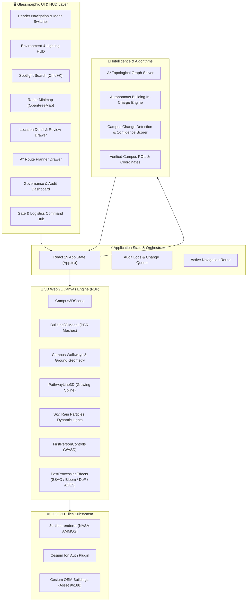

<div align="center">

# 🌐 MAHE Bengaluru — 3D Digital Twin & Geospatial Twin

### *A Next-Generation, Photorealistic, AI-Powered 3D Campus Simulation*

[](LICENSE)
[](https://react.dev/)
[](https://threejs.org/)
[](https://r3f.docs.pmnd.rs/)
[](https://cesium.com/)
[](https://www.typescriptlang.org/)
[](https://vitejs.dev/)
[](https://tailwindcss.com/)
[-8A2BE2.svg?style=for-the-badge&logo=robot&logoColor=white)](AGENTS.md)
[](CONTRIBUTING.md)

<p align="center">
  <b>Explore an 85-acre photorealistic digital replica of MAHE Bengaluru.</b><br>
  Featuring real-time PBR shaders, dynamic day/night/monsoon atmospheres, CesiumGS OGC 3D Tiles streaming, graph-based A* walking navigation, autonomous building in-charge AI personas, and WebXR virtual reality.
</p>

[Explore Features](#-key-features) • [Quickstart](#-getting-started) • [Architecture](#-system-architecture) • [AI Agent Docs](#-ai-agent-discoverability--integration) • [Contributing](#-contributing)

</div>

---

## 🏷️ GitHub Repository Topics & Metadata

If you are open-sourcing or maintaining this repository on GitHub, copy and paste the following recommended tags into your **GitHub Repository Settings > Topics**:

```text
threejs, react-three-fiber, cesium, 3d-tiles, digital-twin, smart-campus, pathfinding, astar-algorithm, webgl, r3f, typescript, vite, tailwindcss, ai-agents, webxr, gis, geospatial, open-source, bengaluru, mahe
```

> **Suggested GitHub Repository Description:**  
> *"Next-generation photorealistic 3D digital twin & AI-guided geospatial simulation of the 85-acre MAHE Bengaluru campus. Built with React Three Fiber, CesiumGS OGC 3D Tiles, Three.js, and TypeScript."*

---

## 📑 Table of Contents

- [Overview](#-overview)
- [✨ Key Features](#-key-features)
  - [1. Photorealistic 3D Graphics & Weather Engine](#1-photorealistic-3d-graphics--weather-engine)
  - [2. CesiumGS OGC 3D Tiles Streaming](#2-cesiumgs-ogc-3d-tiles-streaming)
  - [3. Autonomous "Building In-Charge" AI Agents](#3-autonomous-building-in-charge-ai-agents)
  - [4. A* Topological Walkway Pathfinding Engine](#4-a-topological-walkway-pathfinding-engine)
  - [5. Campus Gate & Logistics Command Hub](#5-campus-gate--logistics-command-hub)
  - [6. Campus Governance & Verification Portal](#6-campus-governance--verification-portal)
  - [7. Multi-Modal Camera & WebXR Virtual Reality](#7-multi-modal-camera--webxr-virtual-reality)
  - [8. Glassmorphic HUD & Radar Minimap](#8-glassmorphic-hud--radar-minimap)
- [🏛️ System Architecture](#️-system-architecture)
- [🧭 Spatial Coordinates & Geospatial Mapping](#-spatial-coordinates--geospatial-mapping)
- [🎮 Camera & Keyboard Controls](#-camera--keyboard-controls)
- [📂 Project Directory Tree](#-project-directory-tree)
- [🚀 Getting Started](#-getting-started)
  - [Prerequisites](#prerequisites)
  - [Installation](#installation)
  - [Environment Configuration](#environment-configuration)
  - [Running Locally](#running-locally)
  - [Building for Production](#building-for-production)
- [🤖 AI Agent Discoverability & Integration](#-ai-agent-discoverability--integration)
- [🤝 Contributing](#-contributing)
- [📜 License & Acknowledgments](#-license--acknowledgments)

---

## 📖 Overview

The **MAHE Bengaluru 3D Digital Twin** is a photorealistic, browser-native spatial computing platform designed for the **Manipal Academy of Higher Education (MAHE) Bengaluru** 85-acre campus located in Yelahanka, Bengaluru.

The platform bridges real-time 3D web rendering, Geographic Information Systems (GIS), and artificial intelligence:
- **For Students & Faculty**: Interactive campus exploration, shortest walking paths between academic blocks, hostel check-in guidance, cafeteria menus, and bus schedules.
- **For Visitors & Guests**: Virtual self-guided tours, gate access procedures, parking navigation, and real-time facility information.
- **For Campus Administrators & Security**: Logistics coordination across Gates 1, 2, and 3, facility maintenance monitoring, and an AI-driven change verification audit queue.
- **For Researchers & Developers**: An open reference architecture demonstrating high-performance WebGL, OGC 3D Tiles integration, procedural shaders, and topological graph solvers.

---

## ✨ Key Features

### 1. Photorealistic 3D Graphics & Weather Engine
- **Physically Based Rendering (PBR)**: Realistic concrete, brushed aluminum, architectural glass facades with dynamic specular reflections and transparency.
- **Cinema-Grade Global Illumination**: ACES Filmic Tone Mapping paired with High Dynamic Range (HDR) sky illumination and dynamic sun positioning.
- **Post-Processing VFX Stack**:
  - **Screen-Space Ambient Occlusion (SSAO)** for rich architectural contact shadows.
  - **Unreal-style Bloom** highlighting glowing pathways, neon signage, and interior fixtures.
  - **Depth of Field (Bokeh)** with autofocusing camera depth on inspected structures.
  - **Vignette framing** for cinematic presentation.
- **Dynamic Weather & Day/Night Cycles**:
  - Seamlessly switch between **Day**, **Dusk**, and **Night** lighting modes.
  - Interactive **Sun Angle slider** for real-time shadow projection.
  - **Monsoon Rain particle simulator** featuring angled precipitation and dark storm ambient lighting.
- **Render Quality Presets**: Instant toggle between `Performance`, `Balanced`, and `Photorealistic` modes.

### 2. CesiumGS OGC 3D Tiles Streaming
- **Live Geospatial Streaming**: Powered by NASA-AMMOS `3d-tiles-renderer` and `@react-three/fiber`.
- **Cesium Ion Authentication**: Seamless token-based integration for streaming massive global datasets directly into the canvas.
- **Global Context & Terrain**: Loads **Cesium OSM Buildings** (Asset ID `96188`) and **Cesium World Terrain** (Asset ID `1`) for real-world geospatial grounding.
- **Anchored Coordinates**: Accurately referenced to MAHE Bengaluru's real-world centroid: **13.1169° N, 77.5901° E**.

### 3. Autonomous "Building In-Charge" AI Agents
- Every major building and campus facility is staffed by a dedicated AI persona with domain authority:
  - 🚌 **Gate 1**: *Officer Guard Vijay* (Transport, bus pass collections, visitor clearance).
  - 🚛 **Gate 2**: *Inspector Rajesh* (Commercial deliveries, cafeteria trucks, maintenance clearance).
  - 📦 **Gate 3**: *Logistics In-Charge Suresh* (Student courier pickups, Amazon/Swiggy logistics).
  - 🏛️ **Academic Block 1 (AB-1)**: *Dean of Engineering & Computing*.
  - 🎨 **Srishti Houses**: *Srishti Design Curators & Studio Directors*.
  - 📚 **Central Library**: *Chief Librarian* (Operating hours, quiet zones, digital repositories).
- **Interactive Dialogue Drawer**: Natural language Q&A, contextual prompt suggestions, and facility-specific quick actions.

### 4. A* Topological Walkway Pathfinding Engine
- **Graph-Based Walkway Network**: Campus-wide graph connecting entrances, pedestrian plazas, academic wings, and sports turfs.
- **Heuristic Shortest Path**: Employs the Euclidean-distance A* search algorithm for optimal, collision-free pedestrian routes.
- **Visual 3D Route Display**: Renders an animated, glowing cyan 3D spline along the actual paved walkways.
- **Turn-by-Turn Guidance**: Calculates total walking distance in meters, estimated walking time in minutes, landmark waypoints, and step-by-step turn directions.

### 5. Campus Gate & Logistics Command Hub
- Dedicated dashboard for managing campus ingress and egress:
  - **Gate 1 (Main Entrance)**: BMTC / Campus Shuttle schedules to Yelahanka station, visitor RFID passes, administrative transport desk.
  - **Gate 2 (Service Gate)**: Commercial vendor inspections, heavy machinery, cafeteria logistics.
  - **Gate 3 (Delivery / Parcel Hub)**: Courier sorting center, student parcel verification, food delivery staging area.

### 6. Campus Governance & Verification Portal
- **AI-Powered Change Detection**: Scrapes and aggregates campus notices, circulars, and student submissions.
- **Confidence Scoring & Verification**: Automatic verification for high-confidence official circulars; queues low-confidence updates for administrator approval.
- **Tamper-Evident Audit Trail**: Real-time audit logs of all approved, rejected, and auto-synced facility changes.
- **Interactive POI Editor**: Administrators can update opening hours, building status (`active`, `under_construction`, `maintenance`), and facility descriptions.

### 7. Multi-Modal Camera & WebXR Virtual Reality
- **Orbit 3D**: Free-form camera rotation, pitch, and zoom with smooth damping.
- **Aerial (Bird's Eye) View**: 90-degree orthographic-style top-down overview of the entire 85-acre property.
- **First-Person (FPS) Walk Mode**: Keyboard (`W`, `A`, `S`, `D`) and pointer-lock mouse navigation at human eye-level.
- **WebXR Virtual Reality**: Immersive VR headset support for walkthroughs and architectural inspections.

### 8. Glassmorphic HUD & Radar Minimap
- **OpenFreeMap Radar Minimap**: Live bottom-corner radar displaying player heading and surrounding structures.
- **Category Filter Pills**: One-click filtering by `Academic`, `Hostel`, `Café`, `Sports`, `Library`, `Srishti House`, `Entrance`, `Parking`, and `ATM`.
- **Spotlight Search (`Ctrl / Cmd + K`)**: Instant keyboard-driven lookup with fuzzy search across building names, codes, and facilities.

---

## 🏛️ System Architecture



---

## 🧭 Spatial Coordinates & Geospatial Mapping

The 3D canvas represents an accurate local projection of the 85-acre MAHE Bengaluru campus:

| Parameter | Value | Description |
|---|---|---|
| **Campus GPS Center** | `13.1169° N, 77.5901° E` | Govindapura, Yelahanka, Bengaluru 560064 |
| **Canvas Dimensions** | `260m × 260m` | Spatial canvas with zero building mesh overlaps |
| **World Scale Factor** | `1 Three.js unit ≈ 3.5m` | Scaled to match human walking velocity and field of view |
| **Coordinate Axes** | `+X` = East, `+Y` = Altitude (Up), `+Z` = South | Standard right-handed Cartesian coordinate system |
| **Elevation Origin** | `Y = 0` | Ground plane; building models anchor with base on `Y = 0` |

---

## 🎮 Camera & Keyboard Controls

| Action | Control / Keybinding |
|---|---|
| **Rotate 3D View** | Click & Drag Left Mouse Button |
| **Pan Camera** | Click & Drag Right Mouse Button / Two-finger swipe |
| **Zoom In / Out** | Mouse Scroll Wheel / Pinch on trackpad |
| **Walk (FPS Mode)** | `W` (Forward), `A` (Left), `S` (Backward), `D` (Right) |
| **Look Around (FPS)** | Move Mouse (Pointer Lock activated on click) |
| **Exit FPS Walk** | Click **"Exit Walking Mode"** button or press `Escape` |
| **Spotlight Search** | Press `Ctrl + K` (Windows/Linux) or `Cmd + K` (macOS) |
| **Toggle Day / Night** | Sun/Moon button on top navigation bar |
| **Weather & FX HUD** | Expand floating slider in bottom-right corner |

---

## 📂 Project Directory Tree

```
MAHE-BLR-CMAPUS-3D/
├── .github/                      # GitHub workflows, templates, and community health
│   ├── ISSUE_TEMPLATE/
│   │   ├── bug_report.md         # Structured bug report template
│   │   └── feature_request.md    # New feature suggestion template
│   └── PULL_REQUEST_TEMPLATE.md  # Standardized PR review checklist
├── public/                       # Static web assets & icons
│   ├── favicon.svg               # Web favicon
│   └── icons.svg                 # SVG sprite definitions
├── src/
│   ├── components/
│   │   ├── 3d/                   # Three.js / React Three Fiber components
│   │   │   ├── Building3DModel.tsx         # Procedural PBR building geometries & badges
│   │   │   ├── Campus3DScene.tsx           # Primary WebGL canvas, lights, environment
│   │   │   ├── Cesium3DTilesModal.tsx      # Live CesiumGS OGC 3D Tiles streaming
│   │   │   ├── FirstPersonControls.tsx     # FPS walking controller (WASD + PointerLock)
│   │   │   ├── PathwayLine3D.tsx           # A* navigation route spline renderer
│   │   │   └── PostProcessingEffects.tsx   # ACES Filmic, Bloom, SSAO, Bokeh DoF
│   │   ├── admin/                # Governance & Administration
│   │   │   └── AdminDashboard.tsx          # Change request verification & audit logs
│   │   ├── ai/                   # AI Character & Chat Drawers
│   │   │   ├── AIChatDrawer.tsx            # Campus concierge natural language assistant
│   │   │   └── BuildingAgentDrawer.tsx     # Per-facility building in-charge dialogue
│   │   ├── ui/                   # Glassmorphic HUD Overlays
│   │   │   ├── CategoryBar.tsx             # Category filter chips
│   │   │   ├── EnvironmentControlsHUD.tsx  # Day/Night, sun angle, weather HUD
│   │   │   ├── GateManagerModal.tsx        # Gates 1, 2, 3 logistics & access control
│   │   │   ├── HeaderNav.tsx               # Top glass navigation bar
│   │   │   ├── LocationDetailPanel.tsx     # POI details, reviews, menus, and actions
│   │   │   ├── Minimap.tsx                 # OpenFreeMap radar minimap overlay
│   │   │   ├── RoutePlannerPanel.tsx       # A* route navigation drawer
│   │   │   └── SearchBar.tsx               # Instant keyboard search modal
│   │   └── vr/                   # WebXR Virtual Reality
│   │       └── VRExplorationModal.tsx      # VR headset configuration & instructions
│   ├── data/                     # Business Logic, Data Stores & Graph Algorithms
│   │   ├── buildingAgentEngine.ts# AI agent personas, dialogue trees, prompt recommendations
│   │   ├── campusAgentEngine.ts  # Verification queue, audit trail, auto-sync logic
│   │   ├── campusData.ts         # Verified POI database, coordinates, operating hours
│   │   └── pathfindingEngine.ts  # Topological graph, node coordinates, A* solver
│   ├── App.tsx                   # Master layout composition & state coordinator
│   ├── index.css                 # Global CSS rules & Tailwind v4 directives
│   └── main.tsx                  # React 19 application root
├── .env.example                  # Environment variable template
├── AGENTS.md                     # Technical context & guide for AI coding agents
├── CODE_OF_CONDUCT.md            # Contributor Covenant v2.1 code of conduct
├── CONTRIBUTING.md               # Guidelines for contributing to the project
├── LICENSE                       # MIT License
├── llms.txt                      # LLM-standardized index of project documentation
├── package.json                  # Dependencies and build scripts
├── README.md                     # World-class project documentation
├── tailwind.config.js            # Tailwind styling configurations
├── tsconfig.json                 # TypeScript compiler configuration
└── vite.config.ts                # Vite dev server and build configuration
```

---

## 🚀 Getting Started

### Prerequisites
- **Node.js**: `v18.0.0` or higher (Node.js 20+ recommended).
- **npm** (`v9+`), **pnpm**, or **yarn**.
- A WebGL2-compatible modern browser (Chrome, Edge, Firefox, Safari 16.4+, Brave).

### Installation

1. **Clone the repository:**
   ```bash
   git clone https://github.com/Hariprajwal/MAHE-BLR-CMAPUS-3D.git
   cd MAHE-BLR-CMAPUS-3D
   ```

2. **Install project dependencies:**
   ```bash
   npm install
   ```

3. **Configure Environment Variables:**
   Copy the `.env.example` file to create your local `.env`:
   ```bash
   cp .env.example .env
   ```
   Open `.env` and add your **Cesium Ion Token** (free community token available at [ion.cesium.com](https://ion.cesium.com/tokens)):
   ```env
   VITE_CESIUM_ION_TOKEN=your_cesium_ion_token_here
   ```
   *(Note: The core 3D campus model, pathfinding, and AI agents run fully even without a Cesium token; the token is only required for streaming external Cesium OSM 3D tile buildings).*

### Running Locally

Launch the Vite hot-reloading development server:
```bash
npm run dev
```
Open your browser and navigate to `http://localhost:5173`.

### Building for Production

Compile TypeScript and generate an optimized production bundle:
```bash
npm run build
```
Preview the production build locally:
```bash
npm run preview
```

### Code Quality & Linting
Run the Oxlint high-speed linter:
```bash
npm run lint
```

---

## 🤖 AI Agent Discoverability & Integration

This repository is optimized for autonomous AI agents, LLM web scrapers, and AI developer tools (Antigravity, Claude Code, Cursor, Copilot Workspace, Devin):

- **[AGENTS.md](AGENTS.md)**: Machine-readable specifications of our 3D world coordinate system, data schemas (`CampusPOI`, `GraphNode`, `BuildingAgentPersona`), and operational workflows.
- **[llms.txt](llms.txt)**: Standardized file for LLM indexers to summarize repository features and API boundaries.
- **Structured JSON-LD Metadata**: Embedded schema enabling search engines and AI web scrapers to parse campus spatial entities.

```json
{
  "@context": "https://schema.org",
  "@type": "SoftwareApplication",
  "name": "MAHE Bengaluru 3D Digital Twin",
  "applicationCategory": "GeospatialSimulationApplication",
  "operatingSystem": "WebBrowser",
  "offers": {
    "@type": "Offer",
    "price": "0",
    "priceCurrency": "USD"
  },
  "author": {
    "@type": "Person",
    "name": "Hariprajwal",
    "url": "https://github.com/Hariprajwal"
  }
}
```

---

## 🗺️ Roadmap & Upcoming Milestones

- [x] **Phase 1**: Initial R3F Scene setup, procedural ground plane, and campus boundary extrusions.
- [x] **Phase 2**: Srishti Houses integration, verified GPS geolocation (`13.1169° N, 77.5901° E`).
- [x] **Phase 3**: Gate Command & Logistics Hub (Gates 1, 2, 3), visitor access monitoring.
- [x] **Phase 4**: Autonomous Building In-Charge AI Agent Engine & prompt recommendation matrix.
- [x] **Phase 5**: 85-Acre Layout Overhaul with zero mesh collisions, glass curtain walls, asphalt avenues.
- [x] **Phase 6**: NASA-AMMOS CesiumGS OGC 3D Tiles streaming integration (`b3dm` / `i3dm`).
- [x] **Phase 7**: Photorealistic leap: PBR materials, ACES Filmic HDR, Bloom, SSAO, dynamic Day/Night/Rain.
- [ ] **Phase 8**: Live BMTC & Campus Shuttle GPS Telemetry streaming over WebSockets.
- [ ] **Phase 9**: Multi-story architectural interior floorplan visualization with floor selector.
- [ ] **Phase 10**: Multiplayer student avatars with spatial audio WebRTC voice chat.

---

## 🤝 Contributing

We warmly welcome contributions from open-source developers, students, researchers, and 3D designers!

1. Check out our [Contributing Guidelines](CONTRIBUTING.md) for branch naming and commit conventions.
2. Read the [Code of Conduct](CODE_OF_CONDUCT.md).
3. Browse open [Issues](https://github.com/Hariprajwal/MAHE-BLR-CMAPUS-3D/issues) or submit a new [Feature Request](.github/ISSUE_TEMPLATE/feature_request.md).
4. Fork the repo, commit your changes, and open a [Pull Request](.github/PULL_REQUEST_TEMPLATE.md)!

---

## 📜 License & Acknowledgments

- **Source Code**: Licensed under the [MIT License](LICENSE) © 2026 **Hariprajwal**.
- **Geospatial & 3D Datasets**:
  - 3D Tiles streamed via **Cesium Ion** are subject to Cesium's Terms of Service and OpenStreetMap contributors.
  - Basemap tiles provided via **OpenFreeMap** / OSM.
- **Community**: Built with pride and passion for the **Manipal Academy of Higher Education (MAHE)** Bengaluru community.

<div align="center">
  <sub>⭐ If you find this project useful or inspiring, please consider starring the repository on GitHub! ⭐</sub>
</div>
